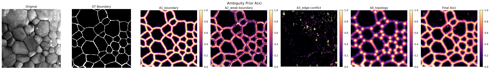

# ax-eval

> 从 SEM 图像中构建模糊先验 A(x)，并评估模型不确定性图与先验的对齐程度

## 项目结构

```
ax-eval/
├── scripts/
│   ├── create_ax/              # A(x) 构造
│   │   ├── config.py           # AmbiguityConfig 超参数配置
│   │   ├── _helpers.py         # robust_norm, to_boundary
│   │   ├── edge_strength.py    # compute_edge_strength (Sobel 边缘)
│   │   ├── proximity.py        # A1: compute_boundary_proximity
│   │   ├── weak_edge.py        # A2: compute_weak_boundary
│   │   ├── edge_conflict.py    # A3: compute_edge_conflict
│   │   ├── topology.py         # A4: compute_topology_complexity
│   │   ├── combine.py          # soft_or_channels
│   │   ├── build.py            # build_ambiguity_prior 编排器
│   │   └── visualize.py        # save_ambiguity_panel
│   ├── metrics_saer/           # sAER 评估指标
│   │   ├── enrichment.py       # compute_saer_off 核心计算
│   │   └── batch.py            # compute_saer_all 批量三通道
│   └── metrics_spearman/       # Spearman 评估指标
│       └── correlation.py      # compute_spearman_r
├── examples/
│   ├── run.py                  # 一键演示全流程
│   ├── input/                  # 示例输入数据
│   └── output/                 # 生成结果
├── README.md
└── requirements.txt
```

## 两个指标

| 指标 | 问什么 | 判断标准 |
|------|--------|----------|
| **spearman_r** | A(x) 高的像素，log_var 也高吗？ | > 0.3 = 趋势正确 |
| **struct_sAER_off** | 远离 GT 边界时，注意力是否富集在结构性模糊区（A₃+A₄）？ | > 1.0 = 注意力倾斜到非平凡模糊 |

## 快速开始

```bash
# 安装依赖
pip install -r requirements.txt

# 运行示例
python examples/run.py
```

```python
from scripts.create_ax import build_ambiguity_prior
from scripts.metrics_saer import compute_saer_all
from scripts.metrics_spearman import compute_spearman_r

# Step 1: 构建 A(x)
A, comps = build_ambiguity_prior(image, mask)

# Step 2: 评估
spearman = compute_spearman_r(log_var, A)
saer = compute_saer_all(log_var, comps["A_boundary"],
                        comps["A_weak_boundary"],
                        comps["A_edge_conflict"],
                        comps["A_topology"], tau=0.2)

print(spearman["spearman_r"])       # 0.74
print(saer["struct_sAER_off"])      # 2.20
```

## A(x) 原理

A(x) 由四个通道通过 soft-OR 合成，编码"一个理性观察者会在哪里预期分割不确定性"：

```
A(x) = 1 - prod_i (1 - w_i * A_i)
```

| 通道 | 模块 | 语义 | 核心超参 |
|------|------|------|----------|
| **A₁** | `proximity.py` | 靠近 GT 边界——过渡区天然模糊 | `sigma_boundary=3` |
| **A₂** | `weak_edge.py` | GT 边界附近但 SEM 图像梯度弱——标注和图像矛盾 | — |
| **A₃** | `edge_conflict.py` | 远离 GT 边界但 SEM 边缘强——冲突信号 | `edge_percentile=90` |
| **A₄** | `topology.py` | 多晶交汇 + 高密度边界区——几何复杂 | `sigma_density=4`, `sigma_junction=6` |

### 示例输出



## 指标详解

### spearman_r

Spearman 秩相关系数——不看数值大小，只看排序趋势。

1. A(x) 和 log_var 各自拉平 → 各 65536 个像素
2. 从小到大排序，赋排名（rank）
3. 对排名算 Pearson r

```
spearman_r ≈ 0  → 不确定性随机分布
spearman_r > 0  → 趋势一致（越高越好）
spearman_r < 0  → 反向（模型有严重问题）
```

### struct_sAER_off

Off-boundary 结构模糊 Soft Enrichment Ratio。

1. 构建目标通道 T = soft-OR(A₃, A₄) × (1 − A₁²) —— 排除边界邻近
2. 切除边界区：只保留 A₁ < τ 的像素
3. 在剩余区内对 log_var 做 softmax → 注意力权重 w
4. sAER = Σ(w·T) / mean(T)

```
sAER_off > 1.0  → 注意力富集在结构性模糊区
sAER_off ≈ 1.0  → 注意力均匀，没有倾斜
sAER_off < 1.0  → 注意力避开了结构性模糊区
```

## 超参数

所有超参数集中在 `AmbiguityConfig` 中：

```python
from scripts.create_ax import AmbiguityConfig

cfg = AmbiguityConfig(
    edge_percentile=90,     # A₃ 强边缘阈值（越高越严格）
    sigma_boundary=3.0,     # A₁ 边界带宽
    sigma_junction=6.0,     # A₄ 交汇点影响范围
    sigma_density=4.0,      # A₄ 密度平滑
    weights=(0.30, 0.25, 0.20, 0.25),  # 四通道 soft-OR 权重
)
A, comps = build_ambiguity_prior(image, mask, config=cfg)
```

## 依赖

- numpy >= 1.21
- scipy >= 1.7
- scikit-image >= 0.18
- opencv-python >= 4.5
- matplotlib >= 3.4

## License

MIT
